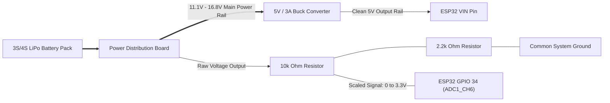
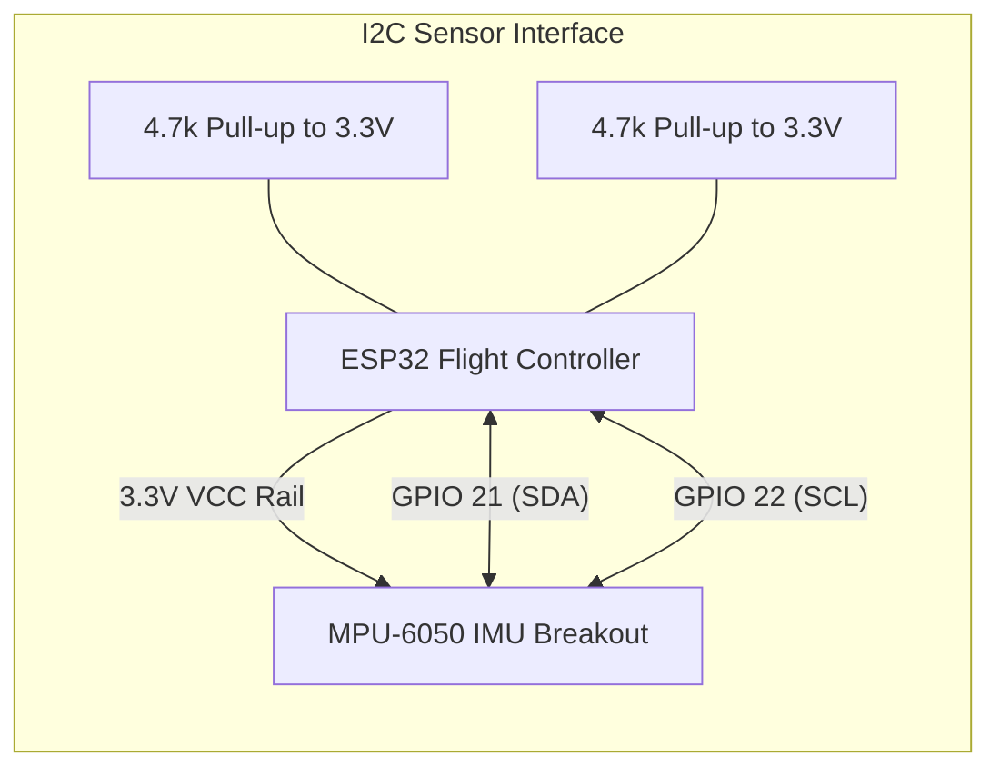
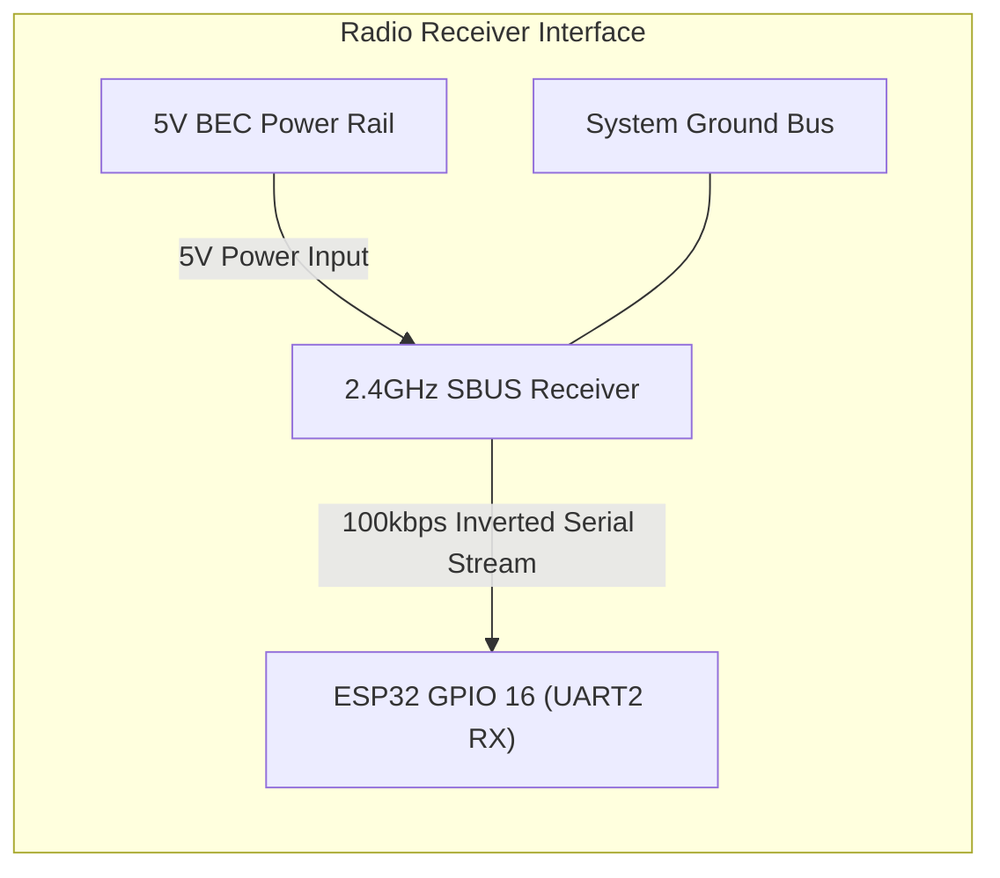
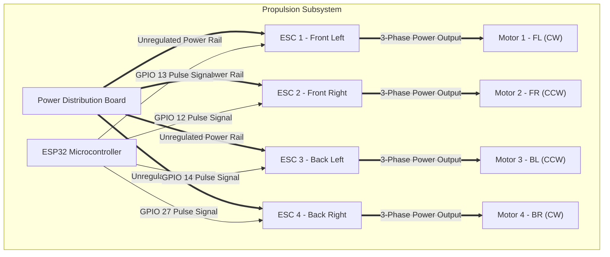
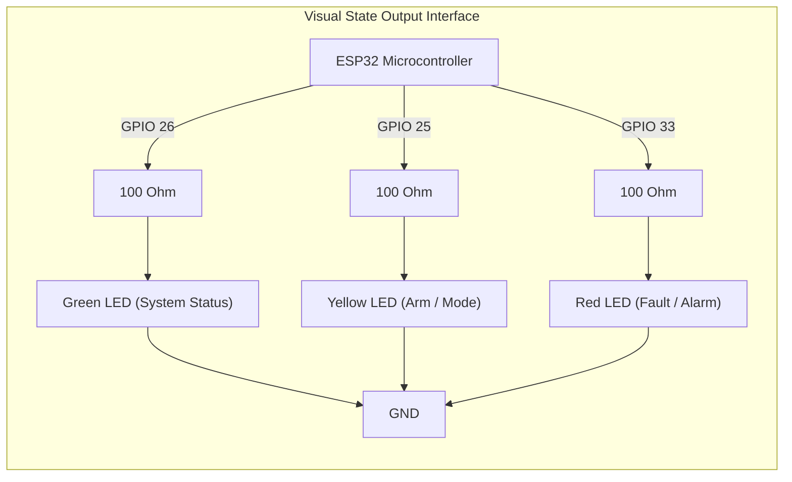

# Hardware Interconnect & Wiring Schematics

This document breaks down the full flight controller hardware schematic into isolated, easy-to-read subsystem modules. 

---

## 1. Power Distribution & Voltage Telemetry Subsystem

This module handles battery power stepping and samples raw LiPo pack voltage for telemetry processing[cite: 1].

### Module Specifications
* **Voltage Divider Ratio:** $10\text{k}\Omega / (10\text{k}\Omega + 2.2\text{k}\Omega) = 0.1803$[cite: 1]
* **Max Analog Input:** $16.8\text{V} \times 0.1803 = 3.03\text{V}$ (Safely within ESP32 3.3V ADC limit)[cite: 1]
* **Power Step-Down:** Buck converter steps raw battery power down to 5V DC at up to 3A[cite: 1].

---

## 2. Inertial Measurement Unit Interface (I2C Bus)

This module handles 6-DOF motion data acquisition from the gyro and accelerometer[cite: 1].

### Module Specifications
* **Bus Speed:** 400kHz Fast-mode I2C[cite: 1]
* **Signal Lines:** GPIO 21 (SDA), GPIO 22 (SCL)[cite: 1]
* **Hardware Requirements:** External $4.7\text{k}\Omega$ pull-up resistors on SDA/SCL lines to guarantee stable pulse transitions[cite: 1].

---

## 3. Remote Control Receiver Link (SBUS Protocol)

This module interfaces the RC receiver with the hardware UART port[cite: 1].

### Module Specifications
* **Baud Rate:** 100,000 bps (8 data bits, Even parity, 2 stop bits - 8E2)[cite: 1]
* **Input Pin:** GPIO 16 (Hardware UART2 RX)[cite: 1]
* **Operating Voltage:** 5V powered via Buck Converter[cite: 1].

---

## 4. Propulsion & ESC Actuator Block

This module routes raw high-current battery voltage to the ESCs and sends precision timing control signals from the ESP32[cite: 1].

### Module Specifications
* **Signal Protocol:** Hardware MCPWM (50Hz - 400Hz update rate)[cite: 1]
* **Pulse Range:** $1000\mu\text{s}$ (Idle) to $1850\mu\text{s}$ (Max Thrust Limit)[cite: 1]
* **Pin Allocation:**
  * ESC 1 (Front Left): `GPIO 13`[cite: 1]
  * ESC 2 (Front Right): `GPIO 12`[cite: 1]
  * ESC 3 (Back Left): `GPIO 14`[cite: 1]
  * ESC 4 (Back Right): `GPIO 27`[cite: 1]

---

## 5. Visual Telemetry & LED Indicator Matrix

This module handles physical visual feedback for armed state, battery level, and fault warnings[cite: 1].

### Module Specifications
* **Current Limiting:** $100\Omega$ resistors per LED branch[cite: 1]
* **Pin Allocation:**
  * System Status (Green): `GPIO 26`[cite: 1]
  * Arm / Mode State (Yellow): `GPIO 25`[cite: 1]
  * Alarm / Fault (Red): `GPIO 33`[cite: 1]

---

## 6. Complete System Pinout Reference Table

| ESP32 Pin | Function | Connected Component | Signal Type | Electrical Parameter |
| :--- | :--- | :--- | :--- | :--- |
| `VIN` | Board Power | 5V Buck Converter Output | Power Input | 5.0V DC[cite: 1] |
| `GND` | Common Ground | Central Power Bus | Ground | 0V Common Reference[cite: 1] |
| `3V3` | Sensor Power | MPU-6050 & Pull-ups | Power Output | 3.3V DC (Max 250mA)[cite: 1] |
| `GPIO 16` | UART2 RX | SBUS Receiver Signal Output | Serial Input | 100kbps Inverted[cite: 1] |
| `GPIO 21` | I2C SDA | MPU-6050 Data Pin | Bidirectional Data | 3.3V Logic with 4.7kΩ Pull-up[cite: 1] |
| `GPIO 22` | I2C SCL | MPU-6050 Clock Pin | Bus Clock Output | 400kHz with 4.7kΩ Pull-up[cite: 1] |
| `GPIO 34` | ADC1 CH6 | Voltage Divider Node | Analog Input | Scaled 0 to 3.03V max[cite: 1] |
| `GPIO 13` | MCPWM CH0 | ESC 1 (Front Left) | PWM Signal | $1000\mu\text{s} - 1850\mu\text{s}$ pulses[cite: 1] |
| `GPIO 12` | MCPWM CH1 | ESC 2 (Front Right) | PWM Signal | $1000\mu\text{s} - 1850\mu\text{s}$ pulses[cite: 1] |
| `GPIO 14` | MCPWM CH2 | ESC 3 (Back Left) | PWM Signal | $1000\mu\text{s} - 1850\mu\text{s}$ pulses[cite: 1] |
| `GPIO 27` | MCPWM CH3 | ESC 4 (Back Right) | PWM Signal | $1000\mu\text{s} - 1850\mu\text{s}$ pulses[cite: 1] |
| `GPIO 26` | Digital Out | Green LED Circuit | Active High Output | Drives via 100Ω resistor[cite: 1] |
| `GPIO 25` | Digital Out | Yellow LED Circuit | Active High Output | Drives via 100Ω resistor[cite: 1] |
| `GPIO 33` | Digital Out | Red LED Circuit | Active High Output | Drives via 100Ω resistor[cite: 1] |
