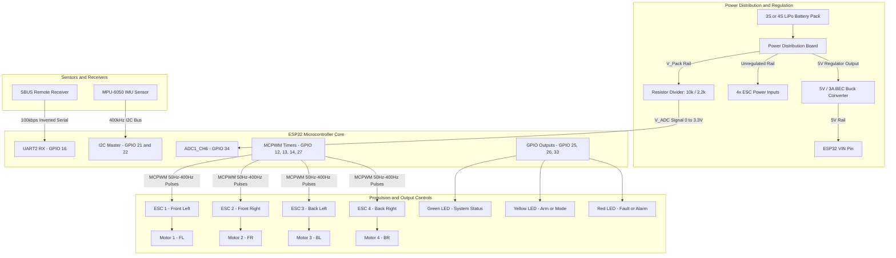
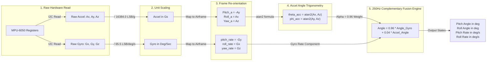
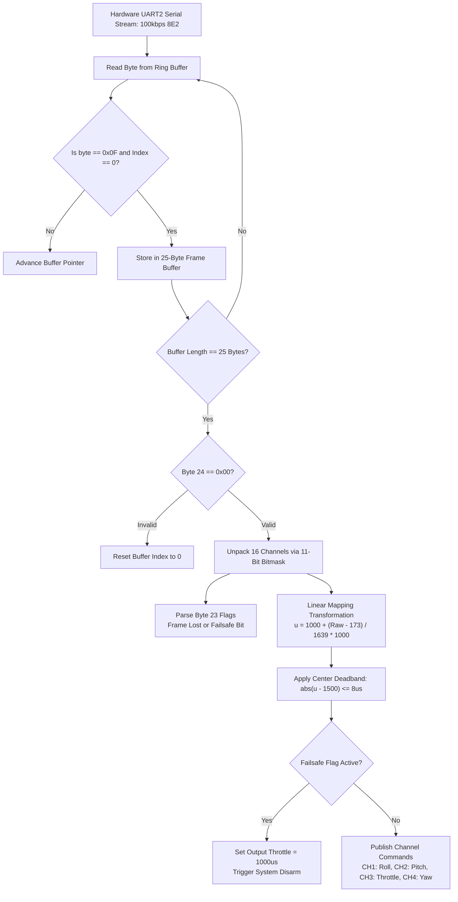
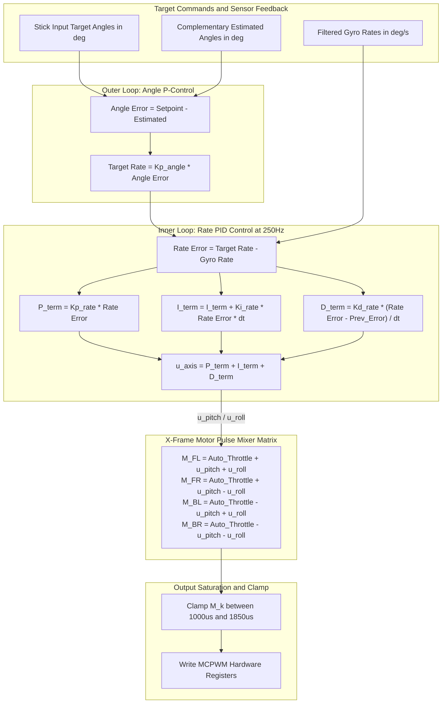
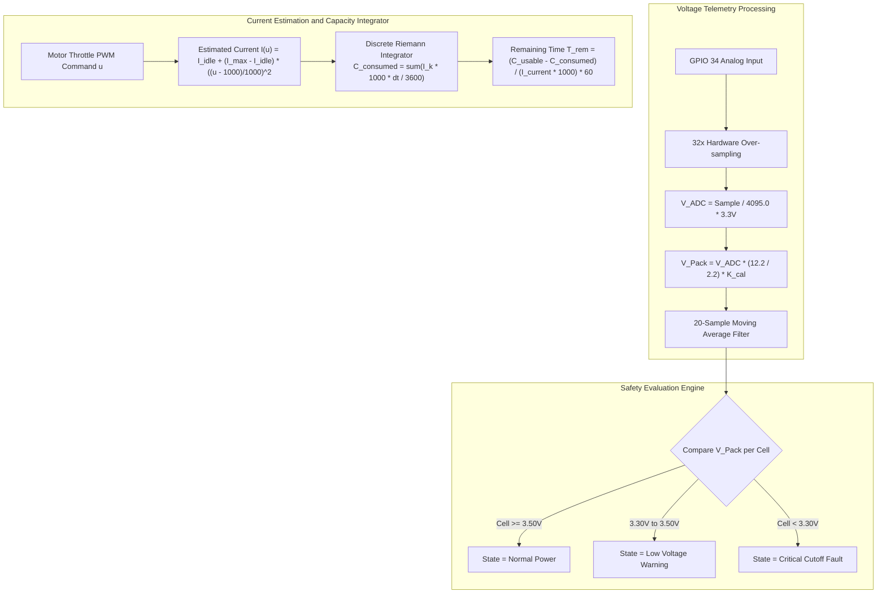
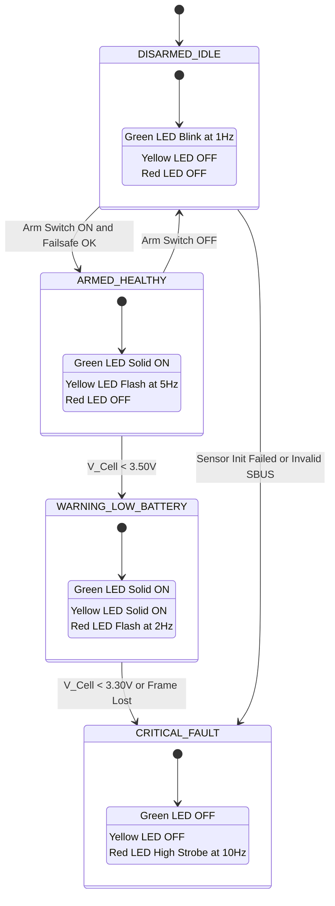

# System Architecture & Hardware Signal Flow

This document details the complete system architecture, sensor fusion pipeline, SBUS decoder, cascade PID control loop, battery telemetry system, and LED state machine for the custom ESP32 Flight Controller.

---

## 1. Master System Hardware Topology

---

## 2. Sensor Fusion & Hardware Axis-Swap Pipeline

---

## 3. SBUS Protocol & Remote Stick Calibration Engine

---

## 4. Dual-Axis Cascade PID Controller & Motor Mixer

---

## 5. Battery Telemetry & Capacity Integrator

---

## 6. LED Indication & System State Machine

